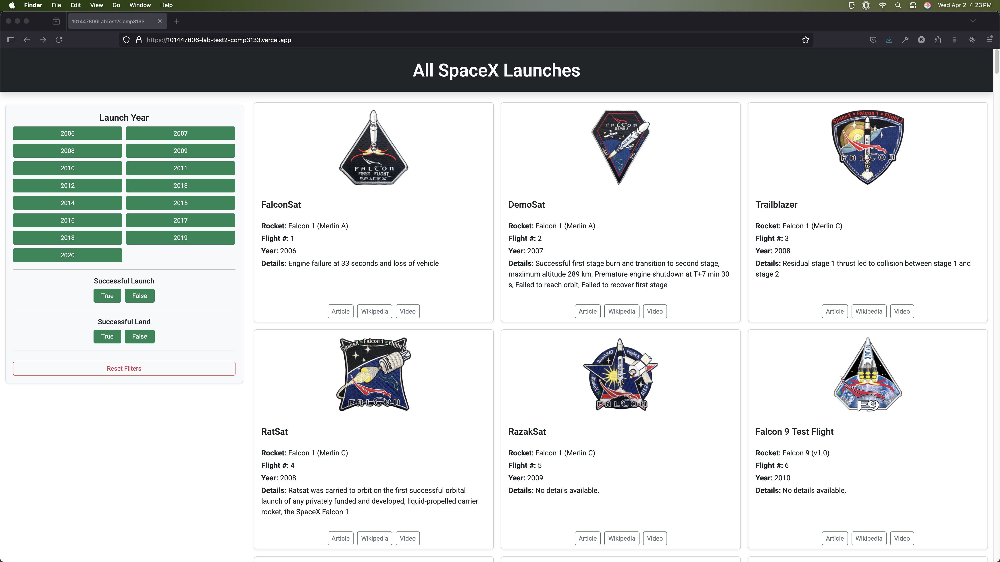
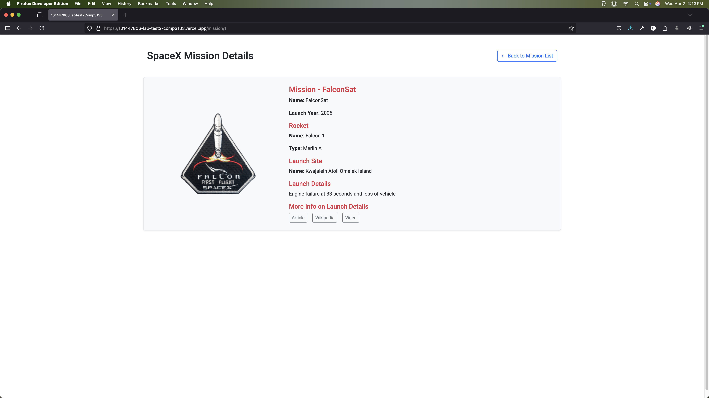
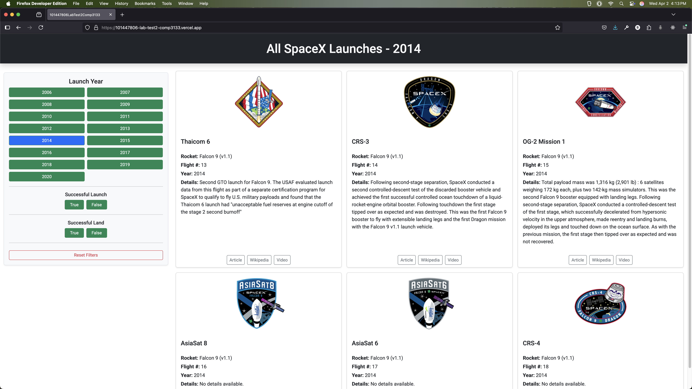
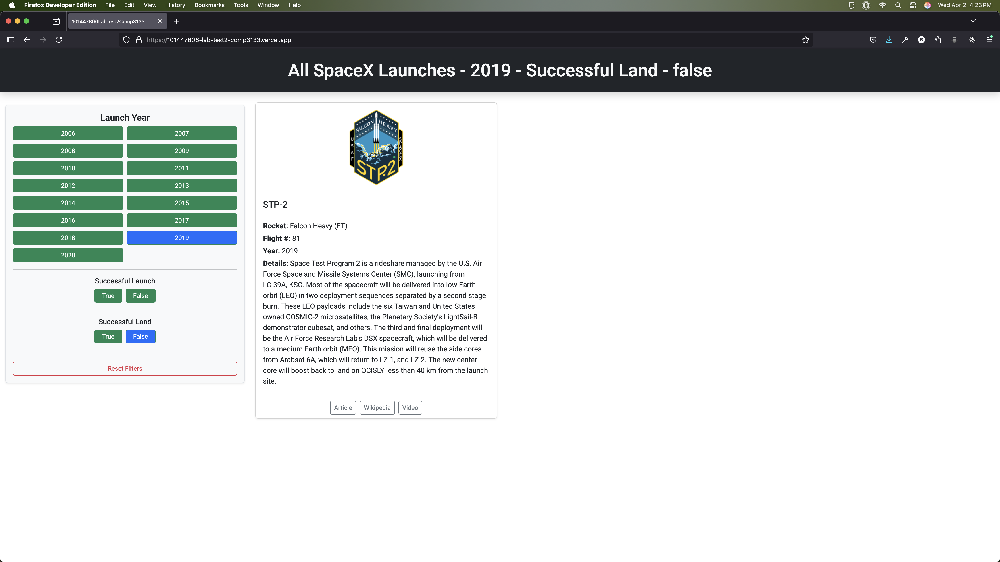
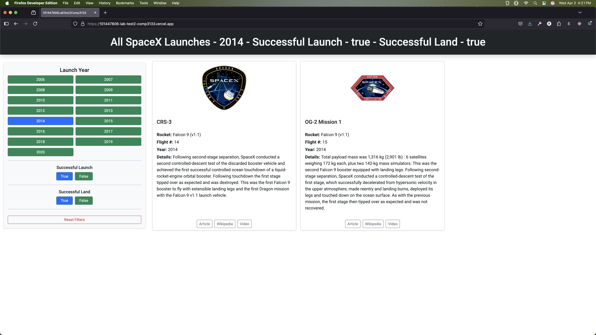
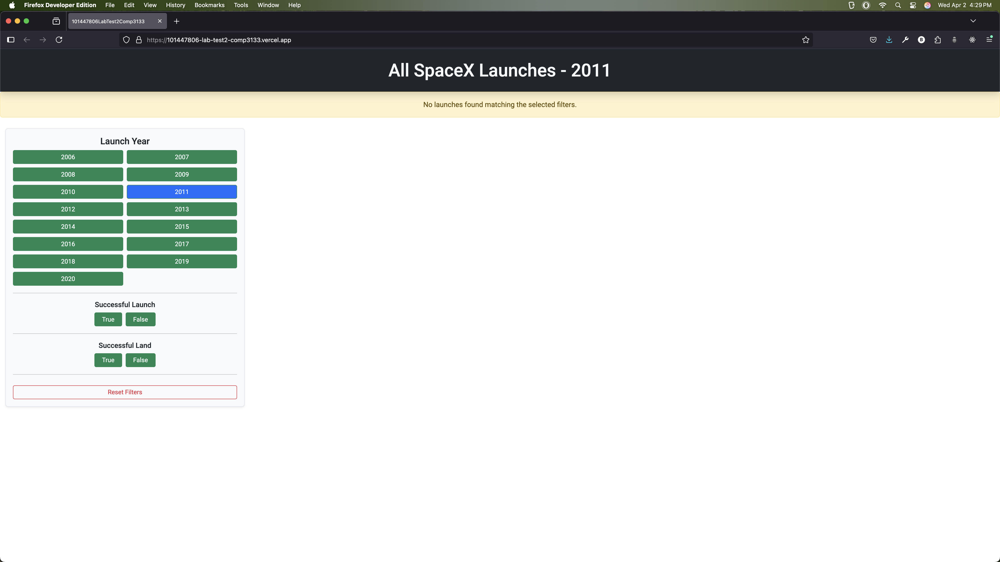

# 🚀 SpaceX Launches Explorer

This is a full-stack Angular application that displays SpaceX mission launches using the official [SpaceX REST API](https://github.com/r-spacex/SpaceX-API). Users can browse all launches, filter them by criteria, and view detailed information for each mission.

## 🚀 Live Demo

You can view the deployed site here: [https://101447806-lab-test2-comp3133.vercel.app/](https://101447806-lab-test2-comp3133.vercel.app/)

---

## 📸 Features

- View a list of all SpaceX launches (from 2006 onward)
- Filter missions by:
  - Launch year
  - Successful launch
  - Successful landing
- Click on a mission card to view full mission details
- Beautiful, responsive UI with custom design

---

## 🛠 Technologies Used

| Tool                              | Purpose                                                          |
| --------------------------------- | ---------------------------------------------------------------- |
| **Angular (v16+)**                | Frontend framework                                               |
| **TypeScript**                    | Static typing                                                    |
| **Angular Standalone Components** | Simplified architecture                                          |
| **Bootstrap 5**                   | UI layout and design system                                      |
| **Angular Material**              | Integrated minimally for assignment requirements (e.g., Toolbar) |
| **SpaceX REST API**               | Data source                                                      |

---

## 📁 Project Structure

```
src/
  └── app/
      ├── components/
      │   ├── missionlist/        # Lists all missions with filters
      │   ├── missiondetails/     # Shows mission detail
      │   └── missionfilter/      # Sidebar filter component
      ├── services/
      │   └── spacex.service.ts   # API calls
      ├── models/
      │   └── launch.interface.ts # Mission data structure
      └── app.routes.ts           # Route definitions
```

---

## 🚀 Getting Started

### 1. Clone the repo

```bash
git clone https://github.com/your-username/spacex-launches-app.git
cd spacex-launches-app
```

### 2. Install dependencies

```bash
npm install
```

### 3. Run the development server

```bash
ng serve
```

Then visit: [http://localhost:4200](http://localhost:4200)

---

## ✅ Completed Assignment Tasks

### ✔️ 1. Angular App Setup

Initialized using standalone components, routing, and Angular CLI best practices.

### ✔️ 2. Component Creation

Created `missionlist`, `missiondetails`, and `missionfilter` components using `ng generate`.

### ✔️ 3. Mission List

Displays mission cards with image, name, rocket info, year, details, and links.

### ✔️ 4. Filtering

Sidebar filters to dynamically narrow down results using API query parameters.

### ✔️ 5. Mission Details Page

Click any mission to navigate to `/mission/:id` and display full details.

### ✔️ 6. Service Integration

All data is fetched from the public SpaceX API using a reusable Angular service.

### ✔️ 7. Interface/Type Structure

Mission data is typed using a custom `Launch` interface in `launch.interface.ts`.

### ✔️ 8. Angular Material Integration

Used `MatToolbar` from Angular Material to fulfill the design enhancement requirement. The rest of the UI was built using Bootstrap 5 for more custom control and flexibility.

---

## 📌 Notes

- The project uses standalone components — no traditional `AppModule` file.
- Bootstrap was chosen over Angular Material for its responsive grid system and visual polish.
- All filtering and routing is handled via Angular's built-in `HttpClient` and `Router`.

---

## 📸 Screenshots

Below are some screenshots of the application in action:

### 🛰️ Mission List Page



### 🔍 Mission Details Page



### 🎯 Filter Examples

**Year Filter**


**Successful Launch Filter**


**Successful Land Filter**


**No Matching Results**


---

## 📄 License

This project is for educational/demo purposes as part of COMP3133 Full Stack Development coursework.
